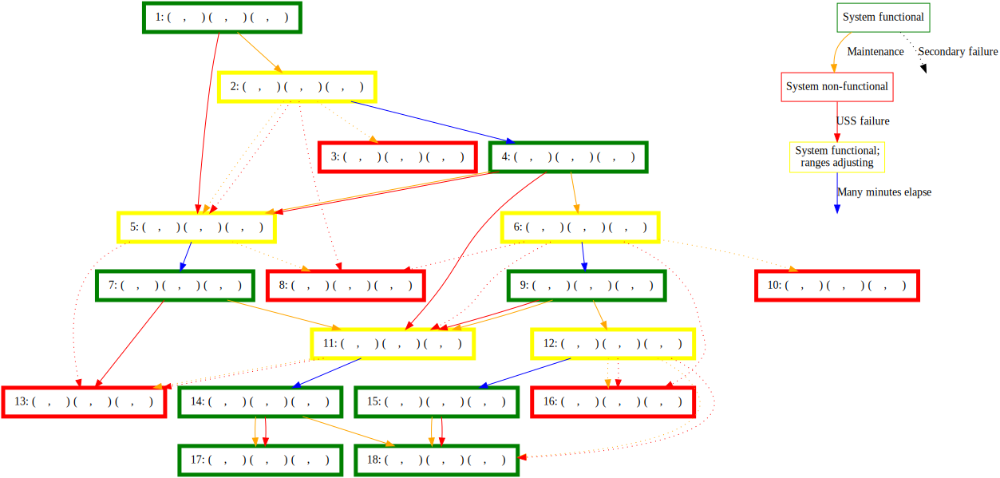

# Kubernetes deployment via Tanka

This folder contains a set of configuration files to be used by
[tanka](https://tanka.dev/install) to deploy a single DSS instance via
Kubernetes following the procedures found in the [build](..) folder.

## Architecture

The expected deployment configuration of a DSS pool supporting a DSS Region is
multiple organizations to each host one DSS instance that is interoperable with
each other organization's DSS instance.  A DSS pool with three participating
organizations (USSs) will have an architecture similar to the diagram below.

_**Note** that the diagram shows 2 stateful sets per DSS instance.  Currently, the
files in this folder produce 3 stateful sets per DSS instance.  However, after
Issue #481 is resolved, this is expected to be reduced to 2 stateful sets._

## Survivability

One of the primary design considerations of the DSS is to be very resilient to
failures.  This resiliency is obtained primarily from the behavior of the
underlying CockroachDB database technology and how we configure it.  The diagram
below shows the result of failures (bringing a node down for maintenance, or
having an entire USS go down) from different starting points.

The table
below summarizes survivable failures with 3 DSS instances configured according
to the architecture described above.  Each system state is summarized by three
groups (one group per USS) of two nodes per USS.

* 🟩 : Functional node has no recent changes in functionality
* 🟥 : Non-functional node in down USS has no recent changes in functionality
* 🟧 : Non-functional node due to USS upgrade or maintenance has no recent changes in functionality
* 🔴 : Node becomes non-functional due to a USS going down
* 🟠 : Node becomes non-functional due to USS upgrade or maintenance

| Pre-existing conditions  | New failures | Survivable?
| --- | --- | ---
| (🟩 , 🟩 ) (🟩 , 🟩 ) (🟩 , 🟩 ) | (🟩 , 🟩 ) (🟩 , 🟩 ) (🟩 , 🟠 ) | 🟢 Yes
|                                    | (🟩 , 🟩 ) (🟩 , 🟠 ) (🟩 , 🟠 ) | 🟢 Yes
|                                    | (🟩 , 🟠 ) (🟩 , 🟠 ) (🟩 , 🟠 ) | 🟢 Yes
|                                    | (🟩 , 🟩 ) (🟩 , 🟩 ) (🔴 , 🔴 ) | 🟢 Yes
|                                    | (🟩 , 🟩 ) (🔴 , 🔴 ) (🔴 , 🔴 ) | 🔴 No; ranges guaranteed to be lost
| (🟩 , 🟩 ) (🟩 , 🟩 ) (🟩 , 🟧 ) | (🟩 , 🟩 ) (🟩 , 🟠 ) (🟩 , 🟧 ) | 🟢 Yes
|                                    | (🟩 , 🟠 ) (🟩 , 🟠 ) (🟩 , 🟧 ) | 🔴 No; some ranges may be lost
|                                    | (🟩 , 🟩 ) (🟩 , 🟩 ) (🔴 , 🔴 ) | 🟢 Yes
|                                    | (🟩 , 🟩 ) (🔴 , 🔴 ) (🟩 , 🟧 ) | 🟡 Yes?
| (🟩 , 🟩 ) (🟩 , 🟧 ) (🟩 , 🟧 ) | (🟩 , 🟠 ) (🟩 , 🟧 ) (🟩 , 🟧 ) | 🟡 Yes?
|                                    | (🟩 , 🟩 ) (🟩 , 🟧 ) (🟠 , 🟧 ) | 🟡 Yes?
|                                    | (🟩 , 🟩 ) (🟩 , 🟧 ) (🔴 , 🔴 ) | 🟡 Yes?
|                                    | (🔴 , 🔴 ) (🟩 , 🟧 ) (🟩 , 🟧 ) | No; ranges guaranteed to be lost
| (🟩 , 🟧 ) (🟩 , 🟧 ) (🟩 , 🟧 ) | (🟩 , 🟧 ) (🟩 , 🟧 ) (🟠 , 🟧 ) | 🟡 Yes?
|                                    | (🟩 , 🟧 ) (🟠 , 🟧 ) (🟠 , 🟧 ) | 🔴 No; ranges guaranteed to be lost
|                                    | (🟠 , 🟧 ) (🟠 , 🟧 ) (🟠 , 🟧 ) | 🔴 No; ranges guaranteed to be lost
|                                    | (🟩 , 🟧 ) (🟩 , 🟧 ) (🔴 , 🔴 ) | 🟡 Yes?
| (🟩 , 🟩 ) (🟩 , 🟩 ) (🟥 , 🟥 ) | (🟩 , 🟩 ) (🟩 , 🟠 ) (🟥 , 🟥 ) | 🟡 Yes?
|                                    | (🟩 , 🟠 ) (🟩 , 🟠 ) (🟥 , 🟥 ) | 🔴 No; some ranges may be lost
|                                    | (🟩 , 🟩 ) (🔴 , 🔴 ) (🟥 , 🟥 ) | 🔴 No; some ranges may be lost

## Sizing
