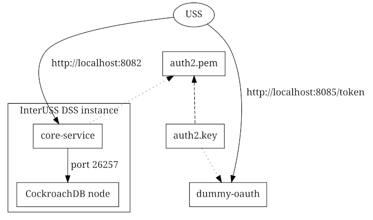

# Simple standalone local test/evaluation/development instance

_Note that all deployment strategies below require the use of [Docker](https://docs.docker.com/v17.12/install/)._

## Architecture

When one of the simple standalone deployments below is used, it will construct a
DSS sandbox environment consisting of:
* A DSS instance, consisting of:
  * A single CockroachDB node running in insecure mode via docker, communicating
    on port 26257 and exposing a web admin console on [port
    8080](http://localhost:8080)
  * [gRPC backend](../../cmds/grpc-backend) listening by default on port 8081,
    configured to
    * Connect to a CockroachDB node at localhost (implicitly port 26257)
    * Validate access tokens with [the auth2.pem public
      key](../test-certs/auth2.pem)
    * Expect access tokens to specify an `aud` of `localhost`
  * [HTTPS gateway](../../cmds/http-gateway) listening on port 8082 and
    directing requests translated into gRPC to port 8081
* A [Dummy OAuth server](../../cmds/dummy-oauth) exposing an endpoint at
  http://localhost:8085/token to generate dummy JWT access tokens that validate
  against [the auth2.pem public key](../test-certs/auth2.pem)

## Quickstart deploy via golang docker-compose containers

If you already have both [docker](https://docs.docker.com/v17.12/install/) and
[docker-compose](https://docs.docker.com/compose/install/) available on your
system, deploy the architecture above by running `docker-compose -f
docker-compose_golang.yaml -p dss_sandbox up` in this folder.

This composition uses [stock golang docker
containers](https://hub.docker.com/_/golang/) to run http-gateway, grpc-backend,
and dummy-oauth.  This has the advantage of not needing to build any docker
images, but it should not be used for ongoing investigations, testing, or
development because all of the Go package dependencies are re-downloaded every
time the system is started.  Instead, use one of the two alternate deployment
methods described below.

## Deploy via local processes

While the CockroachDB node is always hosted in a docker container, the
http-gateway, grpc-backend, and dummy-oauth can be run directly on your
development system to avoid docker overhead at the expense of requiring
[Go](https://golang.org/doc/install) to be set up properly on your system as a
prerequisite.  To do so, simply run [`run_locally.sh`](run_locally.sh).

## Deploy via local InterUSS docker-compose containers

The down side of the quickstart docker-compose deployment above is that it
re-downloads all Go package dependencies every time the system is started.  To
fix this problem and build the system more similarly to how it would be built
and deployed for production:
* Run [`build.sh`](../build.sh) without the DOCKER_URL environment variable set
  (`unset DOCKER_URL`) to build the InterUSS `dss` and `dummy-oauth` images
  locally
* Run `docker-compose -f docker-compose_dss.yaml -p dss_sandbox up` in this
  folder
