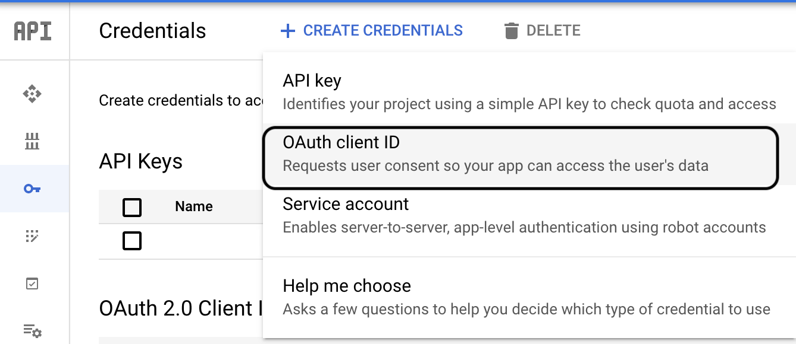
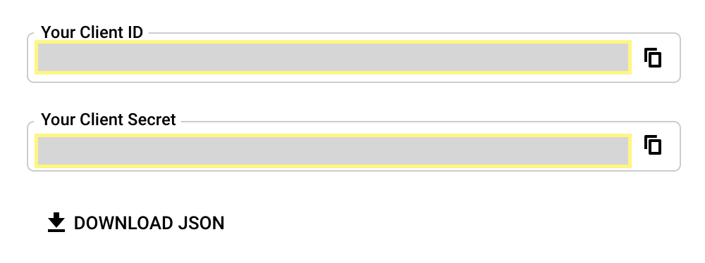

# Creating a Google Client

The first step to enable a Google Login option is to register the application as a client to Google. Let’s walk through the steps to do that.

First, note that you will need a Google Account. You already have one if you use Gmail.

Next, go to the (Google developers credentials page)[https://console.developers.google.com/apis/credentials].

Once in, you may be prompted to agree to their terms of service. Should you agree to those, press the Create credentials button on the next page. Select the option for OAuth client ID:

Select the Web application option at the top. You can provide a name for the client in the Name field as well. The name you provide will be displayed to users when they are consenting to your application acting on their behalf.

You’ll be running your web application locally for now, so you can set the Authorized JavaScript origins to http://localhost:8072 and Authorized redirect URIs to http://localhost:8072/callback. This will allow your local Flask application to communicate with Google.

Finally, hit Create and download the OAuth client secret file.

Rename the file to client_secret.json and copy place it in dss/monitoring/rid_qualifier/host directory.
